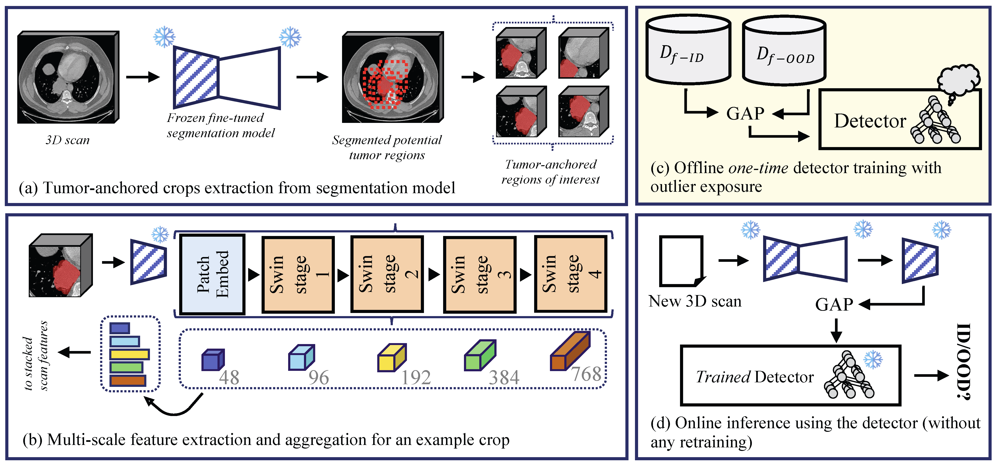
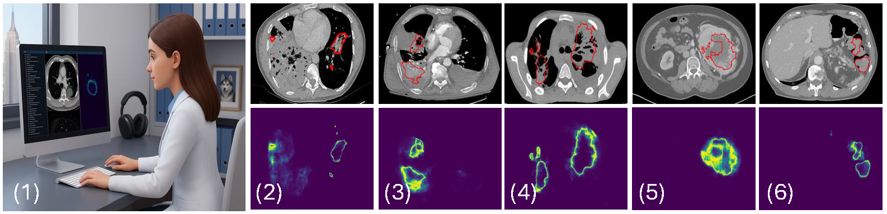

# RF-Deep
### Tumor-anchored deep feature random forests for out-of-distribution detection in lung cancer segmentation

<p align="center">
  
</p>

Research codebase for post-hoc out-of-distribution detection in 3D CT lung tumor segmentation. The repository accompanies our work on using tumor-anchored deep features from pretrained-then-finetuned segmentation backbones, together with lightweight random forests and limited outlier exposure, to detect unsafe inputs at scan level.

## Overview

Modern segmentation models can remain highly accurate on in-distribution data while failing confidently on clinically mismatched scans. RF-Deep is designed to detect those failures without modifying the underlying segmentation architecture. Instead of relying only on logits or architecture-specific uncertainty heads, RF-Deep extracts hierarchical deep features from regions of interest anchored to predicted tumor segmentations and uses them for downstream OOD detection.

<p align="center">
  
</p>

Representative in-distribution and out-of-distribution examples from the paper, illustrating how uncertainty maps can appear concentrated, diffuse, or misaligned across different deployment scenarios.

In the paper, RF-Deep is evaluated on 2,056 CT scans spanning in-distribution lung cancer, near-OOD chest CT datasets, and far-OOD abdominal datasets. It achieves strong near-OOD detection and near-perfect far-OOD detection while remaining simple, lightweight, and architecture-agnostic.

## Highlights

- Post-hoc OOD detection for segmentation, without changing the segmentation network
- Tumor-anchored feature extraction from predicted regions of interest
- Support for RF-Deep, radiomics, Mahalanobis, and logit-based baselines
- Metadata-aware and scanner-aware analysis utilities
- Figure-generation and analysis scripts used for the paper

## Repository at a Glance

- [`ood_rfdeep.py`](ood_rfdeep.py): main RF-Deep experiment entrypoint
- [`extract_features.py`](extract_features.py): deep-feature extraction from segmentation backbones
- [`ood_maha.py`](ood_maha.py): Mahalanobis deep-feature baseline (with optional ReAct/ASH transforms)
- [`logit_baselines.py`](logit_baselines.py): logit-derived OOD baselines and analysis
- [`roi_logit_baselines.py`](roi_logit_baselines.py): ROI-restricted logit baselines using the same crop protocol as RF-Deep
- [`ood_metadata_holdout.py`](ood_metadata_holdout.py): metadata-stratified holdout evaluation
- [`segmentation_inference.py`](segmentation_inference.py): segmentation inference utility for supported backbones

## Getting Started

This codebase targets Python 3.9.

```bash
pip install -r requirements.txt
python -m scripts.smoke_check
```

## Pretrained Checkpoints

Segmentation backbone weights used in the paper are released separately. Place them under `models/finetuned_weights/` and `models/pretrained_weights/`, or override the locations with the `FINETUNED_WEIGHTS_ROOT` and `PRETRAINED_WEIGHTS_ROOT` environment variables.

Download here: **[MSKBox RF-Deep](https://mskcc.box.com/s/qb40xi64828hpp97nn7sa1xqk9atja0l)**  
(If the above link does not work at any point, please open an issue on GitHub and it will be addressed promptly.)

## Datasets

RF-Deep is evaluated on public CT collections; this repository redistributes none of them. Obtain each from its original source:

- **NSCLC-Radiomics** — [TCIA](https://www.cancerimagingarchive.net/collection/nsclc-radiomics/)
- **NSCLC-Radiogenomics (LRAD)** — [TCIA](https://www.cancerimagingarchive.net/collection/nsclc-radiogenomics/)
- **RSNA-STR Pulmonary Embolism Detection (RSNA PE)** — [Kaggle](https://www.kaggle.com/competitions/rsna-str-pulmonary-embolism-detection)
- **MIDRC COVID-19 negative CT (MIDRC C19<sup>-</sup>)** — [TCIA](https://www.cancerimagingarchive.net/collection/midrc-ricord-1b/)
- **MIDRC COVID-19 positive CT (MIDRC C19<sup>+</sup>)** — [TCIA](https://www.cancerimagingarchive.net/collection/midrc-ricord-1a/)
- **KiTS** — [kits-challenge.org](https://kits-challenge.org/kits23/)
- **PancreasCT** — [medicaldecathlon.com](https://drive.google.com/file/d/1YZQFSonulXuagMIfbJkZeTFJ6qEUuUxL/view?usp=drive_link)
- **Breast cancer CT** — institutional internal dataset, not publicly redistributed

## What Can Be Reproduced Publicly

Using the public datasets listed below together with the released checkpoints, users can reproduce the main RF-Deep workflow: segmentation inference, deep-feature extraction, OOD evaluation, and most analysis scripts. Results that depend on the internal breast cancer CT dataset cannot be reproduced from public data alone, since that cohort is not publicly available.

## Typical Workflow

To reproduce the paper workflow, the main steps are feature extraction, optional baseline generation, RF-Deep evaluation, and figure or analysis generation. Most scripts expect data to be indexed through JSON manifests in [`jsons/`](jsons).

### 1. Feature Extraction

RF-Deep operates on hierarchical backbone (3D Swin Transformer) features extracted from the segmentation model.

```bash
python extract_features.py --model smit
```

Feature caches are typically written as `.pkl` files under [`pickle_data/`](pickle_data).

### 2. Baseline Generation

To compare RF-Deep against radiomics or logit-based uncertainty baselines:

```bash
python logit_baselines.py global --metric maxlogit
```

### 3. OOD Detection and Evaluation

Train and evaluate RF-Deep on the ID and OOD datasets:

```bash
python ood_rfdeep.py --method lodo --model-name smit --img-size 128 --train-size 20
```

## Data and Paths

Datasets are expected under `data/` by default, but that path is intentionally ignored because it may be machine-specific or a symlink. Shared code resolves paths through [`project_paths.py`](project_paths.py), and dataset roots can be overridden with environment variables when needed. Metadata required for scanner analysis and PyCERR-based radiomics lives in [`metadata_info/`](metadata_info).

Dataset manifests under [`jsons/`](jsons) are machine-specific and not redistributed; generate them locally with `python -m scripts.make_json` after obtaining the datasets. See [`jsons/README.md`](jsons/README.md) for the manifest schema.

## Repository Guide

- [`PROJECT_LAYOUT.md`](PROJECT_LAYOUT.md): canonical directory layout and output policy
- [`CODE_REFERENCE.md`](CODE_REFERENCE.md): module-by-module reference for the shared codebase
- [`AGENTS.md`](AGENTS.md): orientation file for agentic AI tools (Claude Code, Codex, Cursor, etc.)
- [`models/README.md`](models/README.md): model architectures, feature-extraction expectations, and weight directories
- [`paper_figures/README.md`](paper_figures/README.md): figure-generation entrypoints used for paper assets
- [`scripts/README.md`](scripts/README.md): reusable operational and analysis scripts
- [`jsons/README.md`](jsons/README.md): dataset manifest conventions
- [`metadata_info/README.md`](metadata_info/README.md): synced metadata inputs for scanner, holdout, and radiomics-support analysis
- [`results/README.md`](results/README.md): generated analysis outputs
- [`radiomics_features/README.md`](radiomics_features/README.md): generated radiomics CSV outputs
- [`pickle_data/README.md`](pickle_data/README.md): cached deep-feature pickle outputs
- [`excelrecords/README.md`](excelrecords/README.md): generated segmentation metric CSV outputs

## Acknowledgement

We sincerely thank the authors of [Swin UNETR](https://github.com/Project-MONAI/research-contributions/tree/main/SwinUNETR) and [SMIT](https://github.com/The-Veeraraghavan-Lab/SMIT) for open-sourcing their code and models. In addition, thanks to these great repositories: [PyTorch](https://github.com/pytorch/pytorch), [MONAI](https://github.com/project-monai/monai), [PyCERR](https://github.com/cerr/pyCERR), [DeepMind Surface Distance](https://github.com/google-deepmind/surface-distance), [NiBabel](https://github.com/nipy/nibabel), _scikit-learn_ among others. Finally, AI-driven coding assistants were used in development of parallelization scripts, code cleanup, and relevant technical documentation.

## Citation

```bibtex
@article{rangnekar2025tumor,
  title={Tumor-anchored deep feature random forests for out-of-distribution detection in lung cancer segmentation},
  author={Rangnekar, Aneesh and Veeraraghavan, Harini},
  journal={arXiv preprint arXiv:2512.08216},
  year={2025}
}
```
